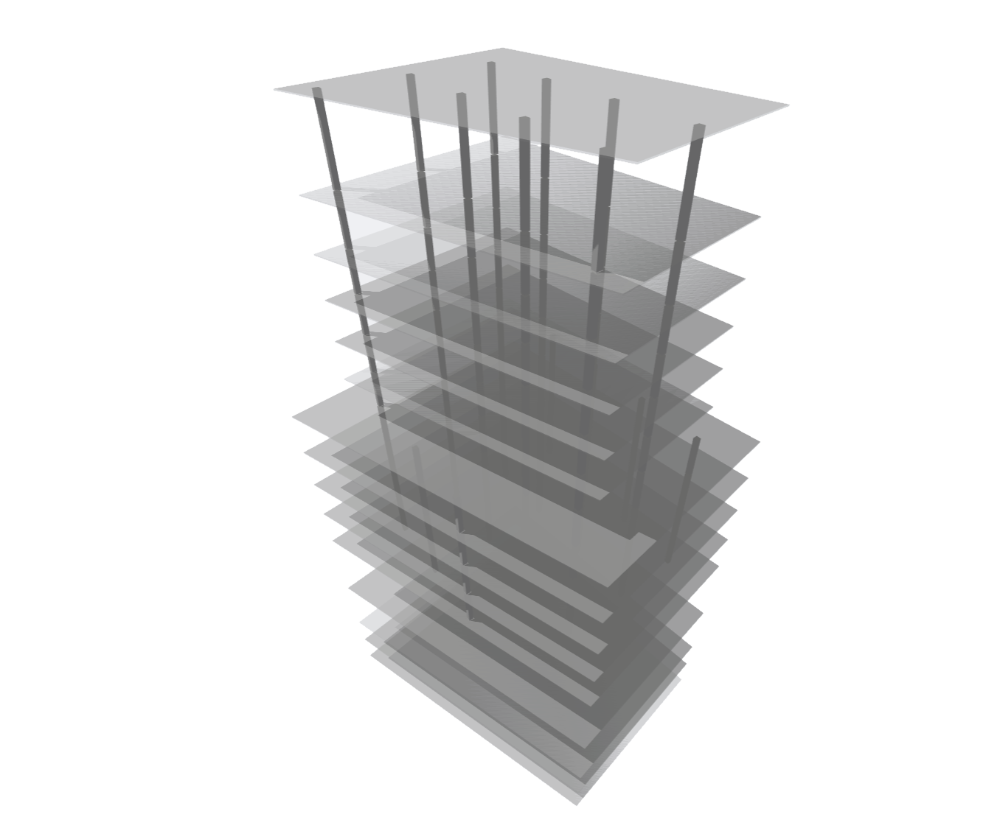

# Columns By Floors

Creates a grid of columns on each floor with the central intervals spanning the floor's centroid.

|Input Name|Type|Description|
|---|---|---|
|Grid X-Axis Interval|Range|Grid interval in the X direction.|
|Grid Y-Axis Interval|Range|Grid interval in the Y direction.|
|Grid Rotation|Range|Rotation of the grid in degrees.|
|Column Diameter|Range|Diameter of the columns.|

 

|Output Name|Type|Description|
|---|---|---|
|Column Quantity|Number|Total quantity of columns.|

