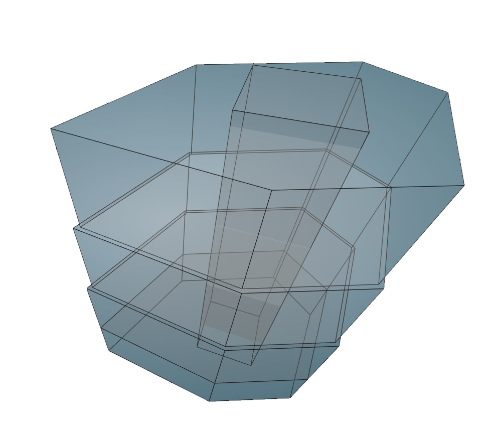

# Core By Envelope

Creates a building service core representation derived from the envelope footprint.

|Input Name|Type|Description|
|---|---|---|
|Percentage Area|Range|Percentage of highest square footage allocated to service core.|
|Length to Width Ratio|Range|Ratio of X to Y length of service core sides.|
|Minimum Perimeter Offset|Range|Minimum distance from service core perimeter to building perimeter.|
|Service Core Penthouse Height|Range|Height of the service core above the highest Envelope.|

 

|Output Name|Type|Description|
|---|---|---|
|Service Core Length|Number|Length of the service core.|
|Service Core Width|Number|Width of the service core.|
|Service Core Rotation|Number|Rotation of the service core.|

