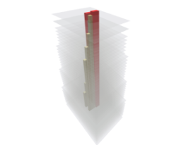

# Core By Levels

Creates a building core by referencing LevelPerimeters supplied by another function.

|Input Name|Type|Description|
|---|---|---|
|Setback|number|Core perimeter setback from envelope.|
|Rotation|number|Core Rotation.|

 

|Output Name|Type|Description|
|---|---|---|
|Restrooms|Number|Restroom quantity.|
|Lifts|Number|Lift quantity.|

 

## Additional Information

