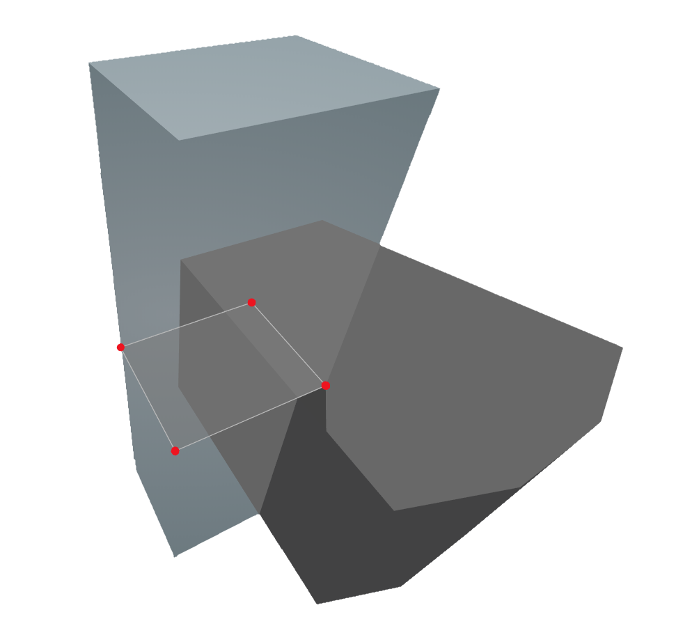

# Core By Sketch

Creates the volume of a building service core by extruding a sketch to a height relative to the highest model Level.

|Input Name|Type|Description|
|---|---|---|
|Perimeter|https://hypar.io/Schemas/Geometry/Polygon.json|Perimeter of the building service core.|
|Core height above roof|number|The projection of the service core above the highest building level.|

 

|Output Name|Type|Description|
|---|---|---|
|Height|Number|Height of the service core.|

