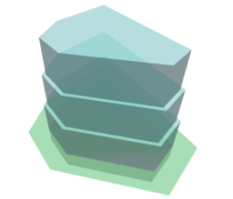

# Envelope By Site

Creates an Envelope from a Site boundary supplied by another function.

|Input Name|Type|Description|
|---|---|---|
|Site Setback|Range|Distance from site boundary to building envelope.|
|Building Height|Range|Overall height of the building from grade.|
|Setback Interval|Range|Vertical distance between envelope setbacks.|
|Setback Depth|Range|Offset depth from previous setback.|
|Minimum Tier Area|Range|Minimum area allowed for a setback tier.|
|Foundation Depth|Range|Depth of the building envelope below grade.|

 

|Output Name|Type|Description|
|---|---|---|
|Height|Number|Height of the building.|
|Subgrade|Number|Depth of the subgrade section.|

