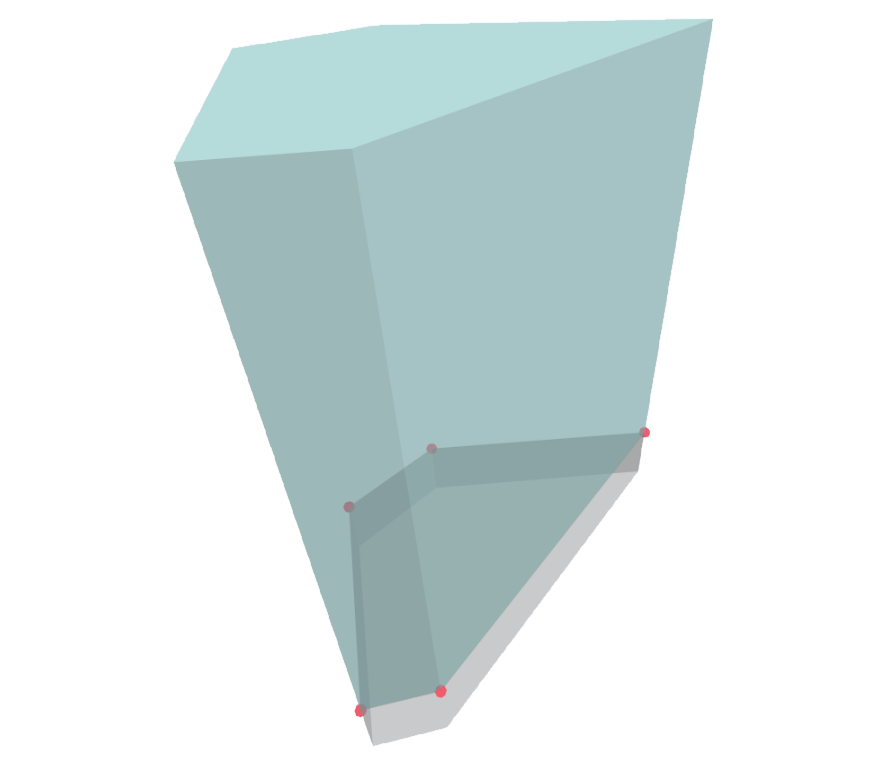

# Envelope By Sketch

Creates building Envelope elements derived from a polygon sketch and setback settings.

|Input Name|Type|Description|
|---|---|---|
|Perimeter|https://hypar.io/Schemas/Geometry/Polygon.json|Perimeter of the building envelope.|
|Create Level Volumes|boolean||
|Setback Interval|number|Vertical distance between envelope setbacks.|
|Use Setbacks|boolean||
|Setback Depth|number|Offset depth from previous setback.|
|Minimum Tier Area|number|Minimum area allowed for a setback tier.|
|Building Height|number|Overall height of the building from grade.|
|Foundation Depth|number|Depth of the building envelope below grade.|

 

|Output Name|Type|Description|
|---|---|---|
|Height|Number|Height of the building.|
|Subgrade|Number|Depth of the subgrade section.|

