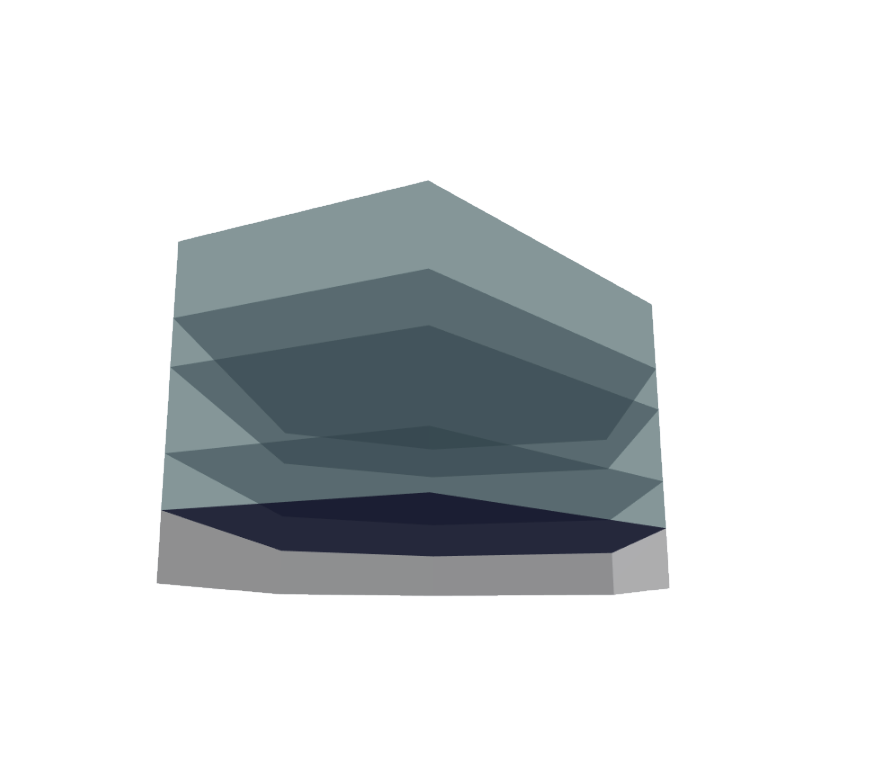

            
# Floors By Levels

Creates Floors from LevelPerimeters supplied by another function.

|Input Name|Type|Description|
|---|---|---|
|Floor Setback|Range|Setback of all floors from each level's perimeter.|
|Floor Thickness|Range|Thickness of all floors.|

 

|Output Name|Type|Description|
|---|---|---|
|Total Area|Number|Aggregate area of all floors.|
|Floor Quantity|Number|Quantity of floors.|

