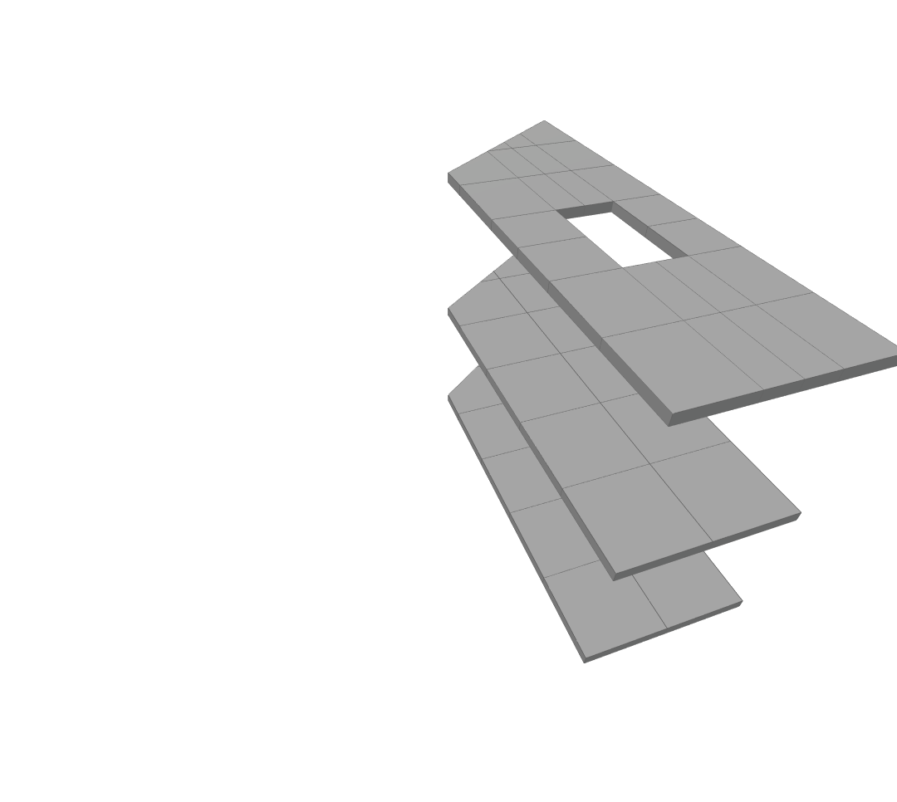

# Subdivide Slab

Subdivide floor slabs into sections

|Input Name|Type|Description|
|---|---|---|
|Length|number|The max length of each subdivision.|
|Width|number|The max width of each subdivision.|
|Subdivide at void corners|boolean|If true, splits will be inserted at the corners of voids.|
|Align to longest edge|boolean|If true, grid orientation will run parallel to the longest edge of the floor boundary.|

 

|Output Name|Type|Description|
|---|---|---|
|Count|Number|Number of regions.|

 

## Additional Information
