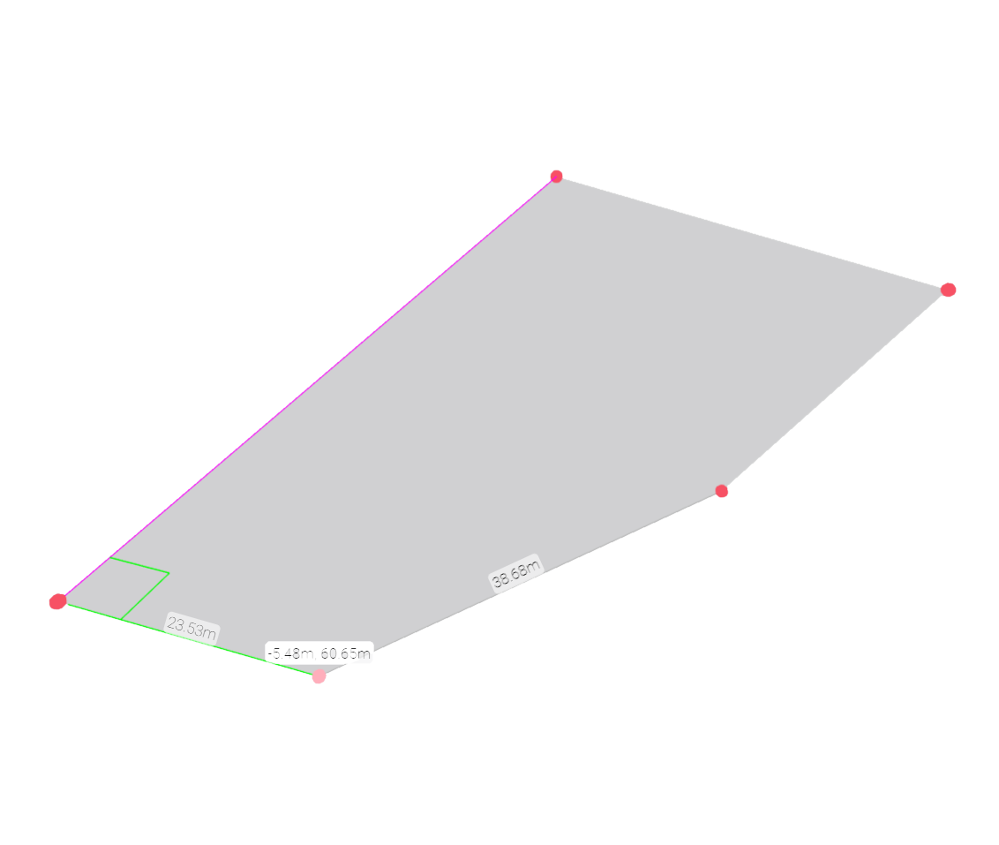

# Level By Sketch

Creates a Level from a sketch.

|Input Name|Type|Description|
|---|---|---|
|Perimeter|https://schemas.hypar.io/Polygon.json|Perimeter of the Level.|
|Level Elevation|number|Level elevation relative to the zero plane.|

 

|Output Name|Type|Description|
|---|---|---|
|Area|Number|Area of the Level Perimeter.|

 

## Additional Information
