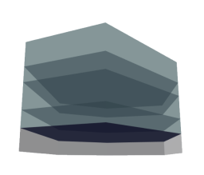

            
# LevelsByEnvelope

Creates Levels and LevelPerimeters from one or more Envelopes supplied by other functions.

https://raw.githubusercontent.com/hypar-io/Schemas/master/Envelope.json

https://raw.githubusercontent.com/hypar-io/Schemas/master/Level.json

https://raw.githubusercontent.com/hypar-io/Schemas/master/LevelPerimeter.json

|Input Name|Type|Description|
|---|---|---|
|Ground Level Height|Range|Height of ground level.|
|Standard Level Height|Range|Standard height of repeated levels.|
|Mechanical Level Height Ratio|Range|Multiplier of standard level height for mechanical levels.|

 

|Output Name|Type|Description|
|---|---|---|
|Level Quantity|Number|Total number of levels.|
|Total Level Area|Number|Total aggregate area of all levels.|
|Entry Level Height|Number|Height of the ground level.|
|Mechanical Level Height|Number|Height of the mechanical level.|

