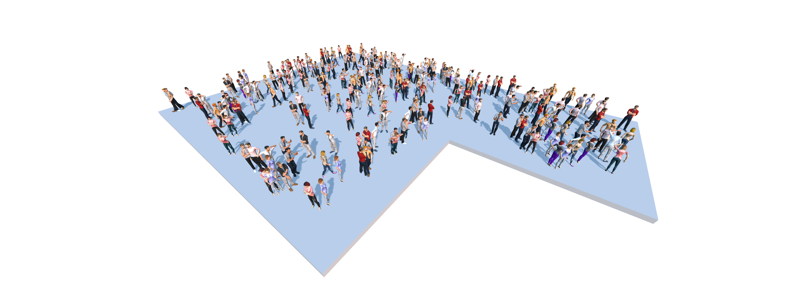

# People

Distribute people on all floors.

|Input Name|Type|Description|
|---|---|---|
|People per floor|number|The number of people to be distributed around each floor.|
|Include Seated People|boolean|Should seated people be included?|

 

|Output Name|Type|Description|
|---|---|---|

 

## Additional Information
The people models used here were [created by Denys Almaral](https://denysalmaral.com/2019/12/20-static-posed-low-poly-free-3d-models.html) under the [Creative Commons License](https://creativecommons.org/licenses/by/4.0/deed.en_US).

