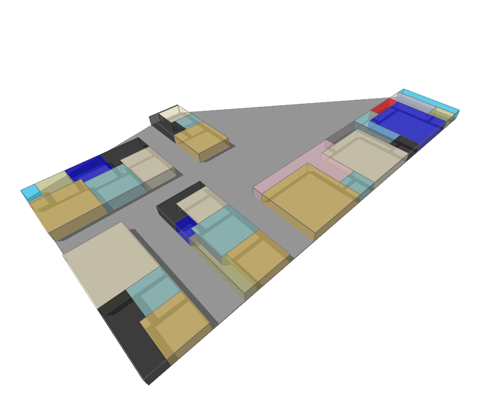

# Plan By Program

Creates plans from a program of Room Defintions as produced by Program By CSV.

|Input Name|Type|Description|
|---|---|---|
|Suite Ratio|number|Desired x-to-y ratio of Suites.|
|Corridor Width|number|Width of all corridors.|
|Plenum Height|number|Vertical distance from highest room to next level above..|
|Multiple Levels|boolean|When adjacency fails, move up one story.|
|Diagonal Adjacency|boolean|Diagonal suite placement is considered adjacent to previous suite.|
|Conform Floors to Rooms|boolean|Creates floors conforming to the merged shape of suite Rooms.|
|Suite Plan Type|string|Axis: Rooms to either side of an axis. Reciprocal: Rooms fitted within a boundary of the suite area at the input ratio.|
|Primary Direction|string|Selects the relative location to attempt compact suite adjacency.|
|Coordinate Adjacency|string|Selects the relative lateral relationship between suites.|

 

|Output Name|Type|Description|
|---|---|---|
|Rooms Placed|Number|Quantity of rooms placed.|
|Total Placed Room Area|Number|Total area of all placed rooms.|
|Total Circulation Area|Number|Total area of horizontal circulation.|
|Total Area|Number|Total area of rooms and circulation.|

