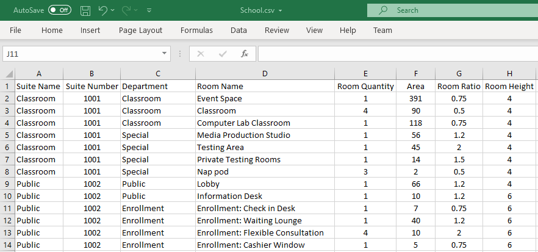

# Program By CSV

Converts a properly formatted Comma Separated Value (.csv) file into space program of Room Definitions compatible with various Hypar space planning functions. See also:
 https://github.com/hypar-io/HyparFunctionInfo/tree/master/Program%20By%20CSV

|Input Name|Type|Description|
|---|---|---|
|Program|https://hypar.io/Schemas/InputData.json|A CSV list of room definitions.|
|Use imperial units|boolean|Default is metric units.|
|Suite Sequence|string|Changes the sequence of the suites.|
|Room Sequence|string|Changes the sequence of the rooms in each suite.|

 

|Output Name|Type|Description|
|---|---|---|
|Room Definition Quantity|Number|Quantity of Room Definitions supplied to the model.|
|Room Quantity|Number|Quantity of Rooms which can be derived from the Room Definitions.|
|Aggregate Program Area|Number|Aggregate area of all Room Definitions.|

 

## Additional Information
