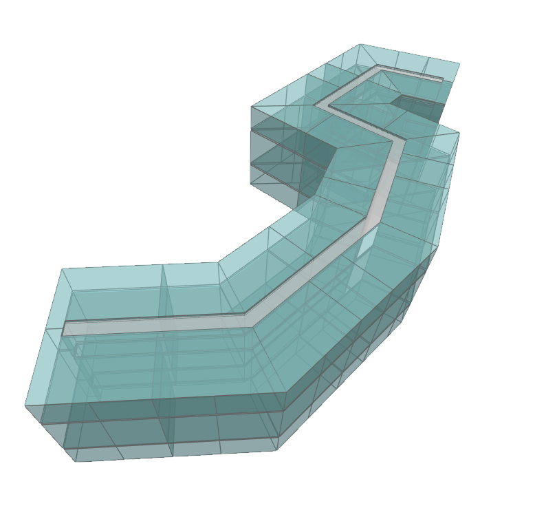

# Rooms By Levels

The Rooms By Levels function.

|Input Name|Type|Description|
|---|---|---|
|Corridor Width|number|Width of the corridor.|
|Room Area|number|Desired area of each room.|

 

|Output Name|Type|Description|
|---|---|---|
|Rooms Per Floor|Number|Quantity of Rooms on each floor.|
|Room Total|Number|Quantity of Rooms in the building.|

 

## Additional Information
