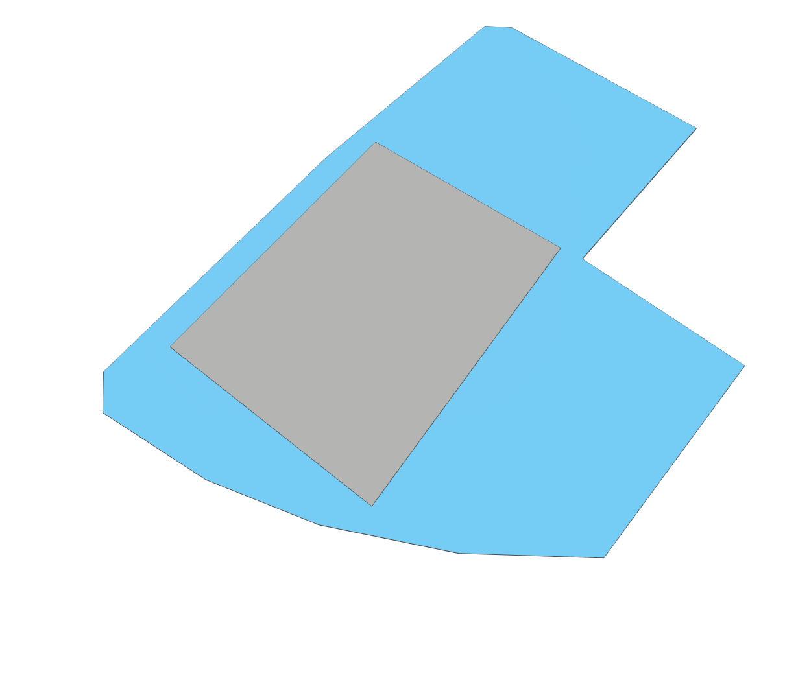

            
# Site

Get topographic and map data for the specified origin.

|Input Name|Type|Description|
|---|---|---|
|Origin|Location|The selected origin of the site.|

 

|Output Name|Type|Description|
|---|---|---|
|Latitude|Number|The latitude of the origin.|
|Longitude|Number|The longitude of the origin.|
|Elevation|Number|The elevation of the origin as it intersects with the topography.|

