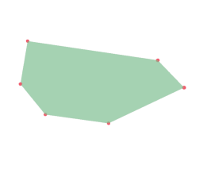

# Site By Sketch

Creates a Site from a polygon sketch.

|Input Name|Type|Description|
|---|---|---|
|Perimeter|https://hypar.io/Schemas/Geometry/Polygon.json|Perimeter of the building envelope.|

 

|Output Name|Type|Description|
|---|---|---|
|Area|Number|Area of the site.|

