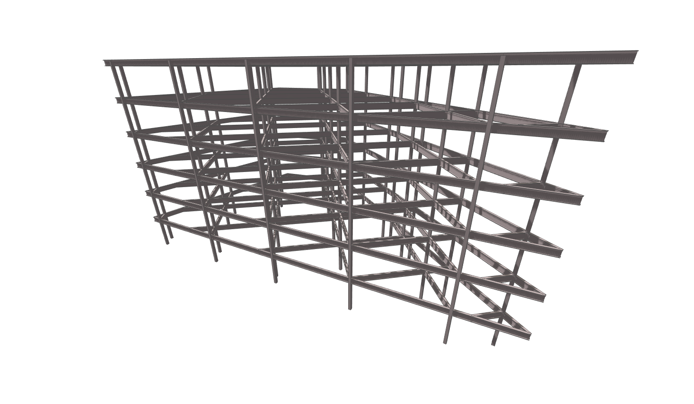

            
# Structure

Generate a structural frame provided a set of Levels and an Envelope.

|Input Name|Type|Description|
|---|---|---|
|Grid X-Axis Interval|Range|Grid interval in the X direction.|
|Grid Y-Axis Interval|Range|Grid interval in the Y direction.|
|Grid Rotation|Range|The amount to rotate the grid in degrees.|
|Color Beams By Length|Boolean|When true, beams are colored according to their length.|

 

|Output Name|Type|Description|
|---|---|---|
|Maximum Beam Length|Number|The maximum beam length.|

