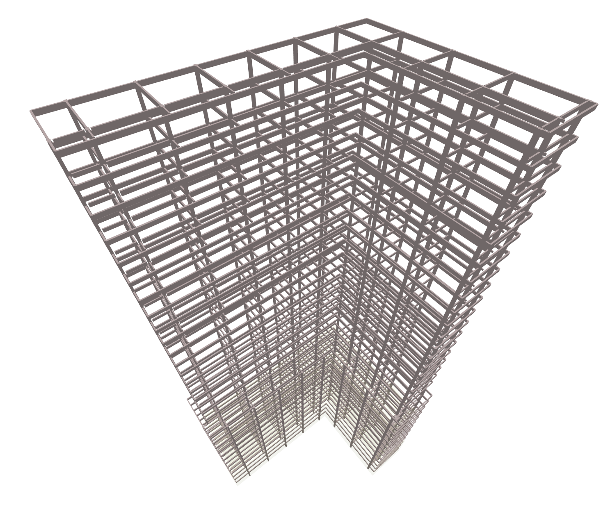

# Structure By Envelope

Generates a structural frame from a set of Levels and an Envelope.

|Input Name|Type|Description|
|---|---|---|
|Column Type|string|The wide flange section shape to use for all columns.|
|Girder Type|string|The wide flange section shape to use for all girders.|
|Beam Type|string|The wide flange section shape to use for all beams.|
|Create Beams On First Level|boolean|Should beams be created at the lowest level of the structure?|

 

|Output Name|Type|Description|
|---|---|---|
|Maximum Beam Length|Number|The maximum beam length.|

